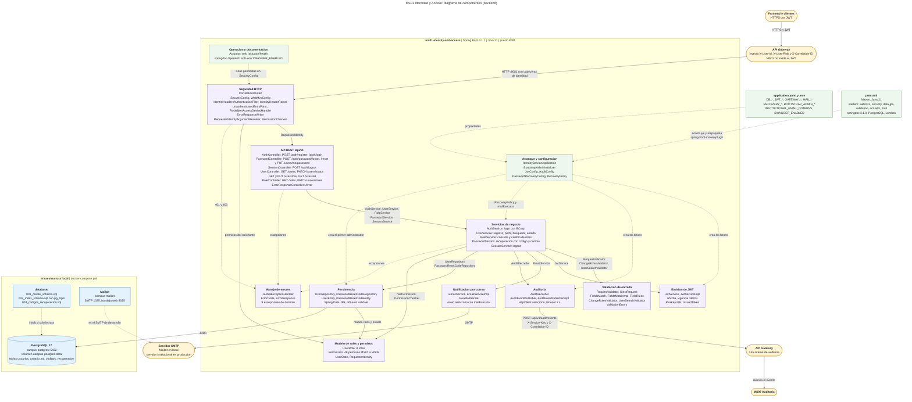

```mermaid
---
title: "MS01 Identidad y Acceso: diagrama de componentes (backend)"
config:
  flowchart:
    curve: basis
    wrappingWidth: 420
    nodeSpacing: 50
    rankSpacing: 70
---
flowchart TB
    %% Alcance: carpeta completa del backend ms01-identity-and-access
    %% (src/main, pom.xml, application.yaml, .env.example, docker-compose.yml y database/*.sql).
    %% Trazo continuo = llamada o uso directo (la etiqueta nombra la interfaz o el protocolo).
    %% Trazo punteado = configuracion, creacion de beans, excepciones o dependencia de arranque.

    %% ------------------------------------------------------------ sistemas externos
    CLI(["<b>Frontend y clientes</b><br/>HTTPS con JWT"])
    GWIN(["<b>API Gateway</b><br/>inyecta X-User-Id, X-User-Role y X-Correlation-ID<br/>MS01 no valida el JWT"])

    %% ------------------------------------------------------------ MS01
    subgraph MS01["<b>ms01-identity-and-access</b>  |  Spring Boot 4.1.1  |  Java 21  |  puerto 8081"]
        SEG["<b>Seguridad HTTP</b><br/>CorrelationIdFilter<br/>SecurityConfig, WebMvcConfig<br/>IdentityHeadersAuthenticationFilter, IdentityHeaderParser<br/>UnauthenticatedEntryPoint, ForbiddenAccessDeniedHandler<br/>ErrorResponseWriter<br/>RequesterIdentityArgumentResolver, PermissionChecker"]

        API["<b>API REST  /api/v1</b><br/>AuthController: POST /auth/register, /auth/login<br/>PasswordController: POST /auth/password/forgot, /reset<br/>y PUT /users/me/password<br/>SessionController: POST /auth/logout<br/>UserController: GET /users, PATCH /users/status<br/>GET y PUT /users/me, GET /users/id<br/>RoleController: GET /roles, PATCH /users/roles<br/>ErrorResponseController: /error"]

        SVC["<b>Servicios de negocio</b><br/>AuthService: login con BCrypt<br/>UserService: registro, perfil, busqueda, estado<br/>RoleService: consulta y cambio de roles<br/>PasswordService: recuperacion con codigo y cambio<br/>SessionService: logout"]

        VAL["<b>Validacion de entrada</b><br/>RequestValidator, StrictRequest<br/>FieldsMatch, FieldsMatchImpl, FieldRules<br/>ChangeRolesValidator, UserSearchValidator<br/>ValidationErrors"]

        JWT["<b>Emision de JWT</b><br/>JwtService, JwtServiceImpl<br/>RS256, vigencia 3600 s<br/>RsaKeyUtils, IssuedToken"]

        MAIL["<b>Notificacion por correo</b><br/>EmailService, EmailServiceImpl<br/>JavaMailSender<br/>envio asincrono con mailExecutor"]

        AUD["<b>Auditoria</b><br/>AuditRecorder<br/>AuditEventPublisher, AuditEventPublisherImpl<br/>HttpClient asincrono, timeout 2 s"]

        PER["<b>Persistencia</b><br/>UserRepository, PasswordResetCodeRepository<br/>UserEntity, PasswordResetCodeEntity<br/>Spring Data JPA, ddl-auto validate"]

        DOM["<b>Modelo de roles y permisos</b><br/>UserRole: 8 roles<br/>Permission: 48 permisos MS01 a MS08<br/>UserState, RequesterIdentity"]

        ERR["<b>Manejo de errores</b><br/>GlobalExceptionHandler<br/>ErrorCode, ErrorResponse<br/>9 excepciones de dominio"]

        CFG["<b>Arranque y configuracion</b><br/>IdentityServiceApplication<br/>BootstrapAdminInitializer<br/>JwtConfig, AuditConfig<br/>PasswordRecoveryConfig, RecoveryPolicy"]

        OPS["<b>Operacion y documentacion</b><br/>Actuator: solo /actuator/health<br/>springdoc OpenAPI: solo con SWAGGER_ENABLED"]
    end

    %% ------------------------------------------------------------ archivos de configuracion y construccion
    ENV["<b>application.yaml y .env</b><br/>DB_*, JWT_*, GATEWAY_*, MAIL_*<br/>RECOVERY_*, BOOTSTRAP_ADMIN_*<br/>INSTITUTIONAL_EMAIL_DOMAINS, SWAGGER_ENABLED"]
    POM["<b>pom.xml</b><br/>Maven, Java 21<br/>starters: webmvc, security, data-jpa,<br/>validation, actuator, mail<br/>springdoc 3.1.0, PostgreSQL, Lombok"]

    %% ------------------------------------------------------------ infraestructura (docker-compose.yml y database)
    subgraph INF["<b>Infraestructura local</b>  |  docker-compose.yml"]
        PG[("<b>PostgreSQL 17</b><br/>campus-postgres :5432<br/>volumen campus-postgres-data<br/>tablas usuarios, usuario_rol, codigos_recuperacion")]
        SQL["<b>database/</b><br/>001_create_schema.sql<br/>002_index_schema.sql con pg_trgm<br/>003_codigos_recuperacion.sql"]
        MP["<b>Mailpit</b><br/>campus-mailpit<br/>SMTP 1025, bandeja web 8025"]
    end

    SMTP(["<b>Servidor SMTP</b><br/>Mailpit en local<br/>servidor institucional en produccion"])
    GWOUT(["<b>API Gateway</b><br/>ruta interna de auditoria"])
    MS08(["<b>MS08 Auditoria</b>"])

    %% ------------------------------------------------------------ flujo de una peticion
    CLI -->|"HTTPS y JWT"| GWIN
    GWIN -->|"HTTP :8081 con cabeceras de identidad"| SEG
    SEG -->|"RequesterIdentity"| API
    API -->|"AuthService, UserService, RoleService<br/>PasswordService, SessionService"| SVC
    SEG -->|"permisos del solicitante"| DOM

    %% ------------------------------------------------------------ colaboracion entre componentes
    SVC -->|"RequestValidator<br/>ChangeRolesValidator, UserSearchValidator"| VAL
    SVC -->|"JwtService"| JWT
    SVC -->|"EmailService"| MAIL
    SVC -->|"AuditRecorder"| AUD
    SVC -->|"UserRepository<br/>PasswordResetCodeRepository"| PER
    SVC -->|"hasPermission, PermissionChecker"| DOM
    PER -->|"mapea roles y estado"| DOM

    %% ------------------------------------------------------------ salidas hacia sistemas externos
    PER -->|"JDBC"| PG
    MAIL -->|"SMTP"| SMTP
    AUD -->|"POST /api/v1/audit/events<br/>X-Service-Key y X-Correlation-ID"| GWOUT
    GWOUT -->|"reenvia el evento"| MS08
    MP -.->|"es el SMTP de desarrollo"| SMTP
    SQL -.->|"initdb.d solo lectura"| PG

    %% ------------------------------------------------------------ errores
    API -.->|"excepciones"| ERR
    SVC -.->|"excepciones"| ERR
    SEG -.->|"401 y 403"| ERR

    %% ------------------------------------------------------------ arranque y configuracion
    ENV -.->|"propiedades"| CFG
    CFG -.->|"crea los beans"| JWT
    CFG -.->|"crea los beans"| AUD
    CFG -.->|"RecoveryPolicy y mailExecutor"| SVC
    CFG -.->|"crea el primer administrador"| PER
    OPS -.->|"rutas permitidas en SecurityConfig"| SEG
    POM -.->|"construye y empaqueta<br/>spring-boot-maven-plugin"| CFG

    %% ------------------------------------------------------------ estilos
    classDef externo fill:#fff4d6,stroke:#b8860b,color:#222
    classDef infra fill:#e3f2fd,stroke:#1565c0,color:#222
    classDef componente fill:#f3efff,stroke:#6a4fc0,color:#222
    classDef config fill:#eef7ee,stroke:#2e7d32,color:#222
    class CLI,GWIN,GWOUT,MS08,SMTP externo
    class PG,MP,SQL infra
    class ENV,POM,CFG,OPS config
    class SEG,API,SVC,VAL,JWT,MAIL,AUD,PER,DOM,ERR componente
```